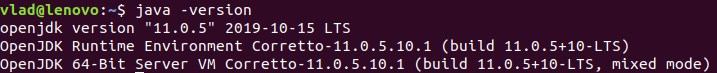
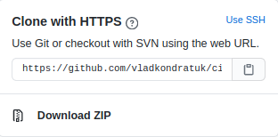
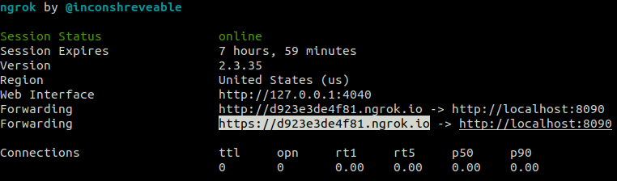
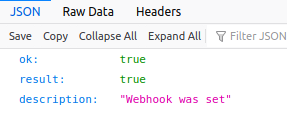
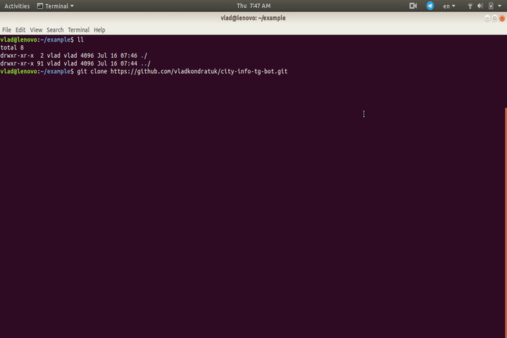
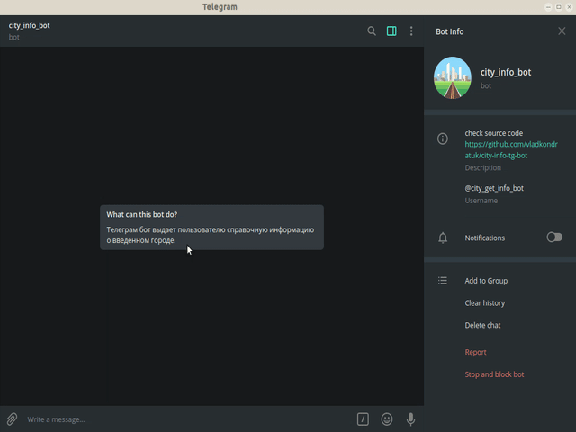

# city-info-tg-bot

[](https://travis-ci.org/vladkondratuk/city-info-tg-bot)

## Project Idea

Telegram bot, which gives background information about the city.

### Prerequisites
   
    install jdk 11 (LTS)
    
  Check JDK version:
    
    $ java -version
    


### Installing

  Install with a git:
  
    $ git clone https://github.com/vladkondratuk/city-info-tg-bot.git
  
  Or install a ZIP archive:
  


### Setup configuration:
    
#### 1. After installing open directory with a project.
  
  If you installed project with a git: 
  
    $ cd city-info-tg-bot
  
  Or if you installed a ZIP archive:
    
    $ cd city-info-tg-bot-master 
  
#### 2. Set up properties.
  
 Go to `../src/main/resources/application.properties`.
   
```properties
    telegrambot.botUsername=@city_get_info_bot
    telegrambot.botToken=1369465168:AAEUhLdSz-W3yGfbTKxUpbpmqRW_KYlFJmM
    telegrambot.botPath=https://daf1908cfd43.ngrok.io
```

Fields meaning:
  
 - `telegrambot.botUsername` - unique name for a bot.
 - `telegrambot.botToken` - each bot is given a unique authentication token. 
 - `telegrambot.botPath` - this is a path where WebHook sent messages.
 
 You need only set up `botPath` with `ngrok`.
 
 `ngrok` - secure introspectable tunnels to localhost webhook development tool and debugging tool.
 
    $ ./ngrok http 8090

  `http 8090` - localhost where embedded tomcat server will be deployed.
  


 `ngrok` - must work on background.
 
  We need url with `https` protocol.
  
  After set up `botPath` we need set WebHook for a bot.
  
  Go to url in your browser: `https://api.telegram.org/bot{botToken}/setWebHook?url={botpath}`
  
  `https://api.telegram.org/bot1369465168:AAGTyL6KshJ7mBz40ZenQXzIMVHyHTdHcek/setWebHook?url=https://d923e3de4f81.ngrok.io`  
  
  Expected output:
  
  
  
### Install & Set up    


### Running bot

  Run terminal command in project directory:
  
    $ ./mvnw spring-boot:run

### Using bot   

      

>Produced by Vladiskav Kondratuk 2020